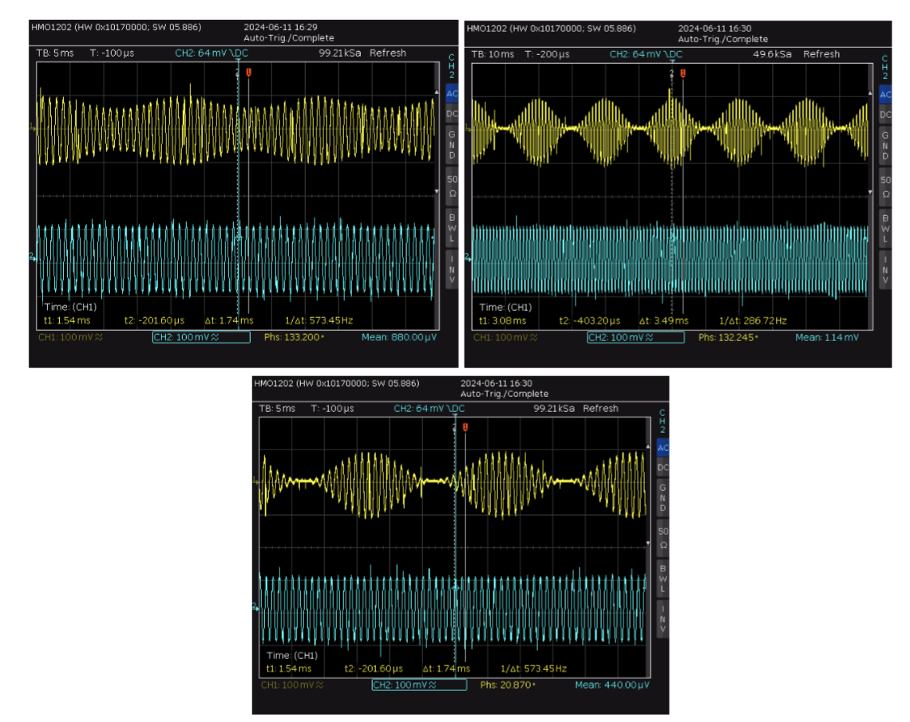

# Guitar Effects Pedal - Capacitive Sensor Project

    

This project focuses on the development of a multi-effects pedal for electric guitars. The pedal integrates a capacitive sensor to manipulate audio effects in real time based on the proximity of the user’s foot to a capacitive plate. This is built using the STM32 microcontroller and includes various iconic guitar effects such as tremolo, fuzz, and overdrive.

**The following explanation is only a summarized version of the project. For more details, feel free to consult the report (in French), which explains the operation of each subcomponent in more detail.**

## Features
- **Capacitive Sensor**: The pedal uses a capacitive plate to adjust effect parameters without physical contact, offering a unique and dynamic user interface.
- **Multi-effects**: The pedal supports a range of effects like fuzz, tremolo, and overdrive, with more effects easily implementable through software updates.
- **STM32 Microcontroller**: A STM32F303-K8 microcontroller is responsible for audio signal processing and handling the effects.
- **Custom PCB and 3D Printed Case**: Designed for compactness and ease of use, the pedal features a custom-printed circuit board (PCB) and a 3D-printed case modeled after well-known pedal designs.

## Hardware Overview
- **Capacitive Sensor**: Detects foot proximity to control effects in real time.

    
    
<em>Figure 1: Operation of the capacitive sensor.</em>

- **STM32F303-K8**: The microcontroller that manages signal processing and control.

    
    
<em>Figure 2: Aspect of the conditionner and STM module.</em>

- **Effect Selector**: A rotary knob to switch between effects.
- **Parameter Adjuster**: A second knob to fine-tune effect parameters.
- **Connectors**: Standard 6.5mm audio jacks for input/output and a USB connector for power and programming.
- **3D Printed Case**: Designed using Inventor and printed using PrusaSlicer.

## Software
The software is written in C and runs on the STM32 platform, leveraging the HAL library for hardware interactions. The effects are implemented using signal processing techniques such as the Fast Fourier Transform (FFT) and digital filters.

    
    
<em>Figure 3: Test of the signal loopback on the ADC/DAC. Output signal in yellow.</em>

### Supported Effects
- **Tremolo**: Modulates the volume of the input signal at a user-defined rate.

    
    
<em>Figure 4: Test of the tremolo signal.</em>

- **Fuzz/Distortion**: Adds harmonic distortion to the signal for a richer, more aggressive tone.

    
    
<em>Figure 5: Test of the distortion signal.</em>

- **Overdrive**: Currently under development, providing a smoother form of distortion.
- **Wah** : Modulates the tone of an audio signal by sweeping through a range of frequencies. 
  
### Future Improvements
- **Effect Variety**: Additional effects can be implemented by updating the software.
- **LCD Display**: Potential to add an LCD for real-time feedback on the selected effect and parameter settings.
- **Improved Sensor Sensitivity**: Increasing the detection range of the capacitive sensor for finer control.

## How to Use
1. **Connect the Pedal**: Plug your guitar into the input jack and connect the output to an amplifier.
2. **Power On**: Use a USB cable to power the pedal and program the microcontroller.
3. **Select Effects**: Use the left rotary knob to select between available effects.
4. **Adjust Parameters**: Modify the intensity or frequency of the effect using the right knob.
5. **Real-Time Control**: Move your foot above the capacitive plate to dynamically alter the effect parameters.

## Setup and Installation
1. **Download the Code**: Clone the repository from GitHub.
2. **Flash the Microcontroller**: Use an ST-Link or USB to flash the STM32F303 with the provided firmware.
3. **Assemble the Hardware**: Follow the instructions in the hardware folder to assemble the pedal and integrate the components.
4. **Test the Pedal**: After assembly, test the pedal with a guitar and amplifier, adjusting the effects using the knobs and capacitive sensor.

## Files and Directories
- **/src**: Contains the main code for the effects and sensor control.
- **/hardware**: Schematics for the custom PCB and 3D printing files for the case.
- **/docs**: Documentation related to the project design and future improvements.

## Acknowledgments
- Inspiration from classic analog pedals such as wah-wah, fuzz, and tremolo.
- Use of STM32F303-K8 microcontroller for audio processing.
- 3D design tools: Inventor and PrusaSlicer for case design and manufacturing.

    
    
<em>Figure 6: PrusaSlicer's view of the 3D model.</em>

## Possibilies of improvement 
- Modulate the code to make it cleaner. 
